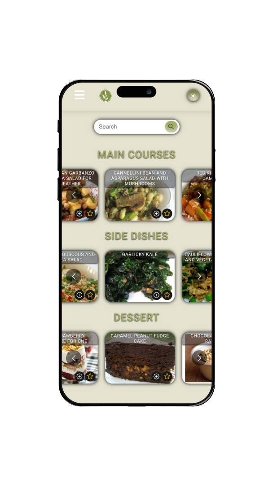

# vegeterianRecipes

 

  <h2 align="center">VegeterianRecipes</h2>

  

     
    <a href="https://github.com/gabrielecruciani/vegetarianRecipes">Explore the docs »</a>
     
     
    <a href="https://vegrecipes-s2i.netlify.app">View Demo</a>
  

<!-- ABOUT THE PROJECT -->
## About The Project

  

 

This website is a project realized for Start2Impact University.

The task was to create a vegetarian recipe site that used spoonacular's API to retrieve data.
To make the site more complete and dynamic I implemented the favorites function so as to have a page with all the saved recipes.
A functional search bar, I also implemented the light/dark theme switch.
I created a working section in the frontend for login but to be implemented with the backend and finally I created a contact form.

### Built With

The application had to be developed with react Framework (based on JavaScript), Html and Css.
 

<!-- LICENSE -->
## License

Distributed under the GENERAL PUBLIC LICENSE. See `LICENSE` for more information.
 

<!-- CONTACT -->
## Socials

